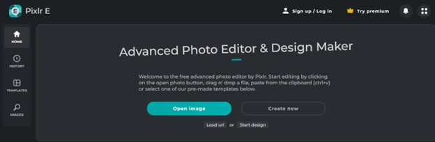
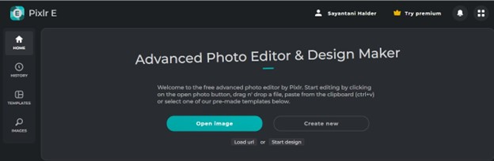
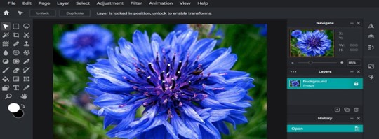
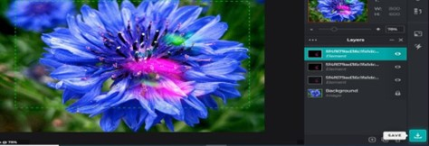
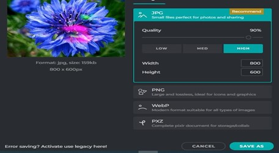

# How to Use Pixlr for Free: A Step-by-Step Guide to Online Photo Editing
## Tool Description
**Pixlr** is a free online photo and video editing software with a powerful suite of tools. Its separate versions for newbies and experienced users that cater to both beginners and professionals. 
 
The free version provides access to all the basic features, like cropping images, filling in colors, adjusting shadows, and much more.
   The best part about Pixlr is that you can directly modify a picture from its URL location for personal use, provided you have the necessary permissions.
 
Pixlr offers two free versions: **Pixlr X** and **Pixlr E**.
  
The major features of **PixlrX** are listed below.  
-	An excellent tool for beginners. Helps aspiring photo editors hone their editing skills.
-	**Resizing and rotating** features.
-	**Crop** features to edit out the unnecessary parts.
-	**Auto-fix** option to change the brightness of a picture to an optimum value.
-	**Preview** option for the edited images before using them.
-	**Free stickers**, **fonts for captions**, and **different shapes of textboxes** to add to the images. 

The major features of **PixlrE** are listed below.  
-	A more professional tool generally used by bloggers and digital marketers.
-	Sophisticated tools like **Lasso**, **Brush**, and **Clone Stamp** features.
-	**Layering images** feature is just like Adobe Photoshop's premium version.
-	**Cool filters** to change the appearance of a photo.
## Key Highlights
-	**Free Versions:** PixlrX (for beginners) and PixlrE (for professionals).
-	**Supported By:** Mac, Windows, and mobile browsers.
-	**Who Can Use:** From beginner to advanced, everyone can choose their version and use Pixlr accordingly.
-	**How to Access:** Visit www.pixlr.com.
### Is Downloading Pixlr Possible?
Both the free versions of Pixlr are browser-based online tools. You don't need to download an app. Anyone can access Pixlr from any device with a proper internet connection.
## Guide to Edit Photos with Free Pixlr Tools
Let’s walk through the Pixlr software and understand its major functionalities. 
This guide will focus on the PixlrE tool, as that’s the professional version widely used in the market.
### Step 1: Accessing PixlrE Editor on Browser
To access PixlrE, the user needs to visit https://pixlr.com/e/
 

  
Sign up or log in to the Pixlr Editor using your email address. Once the authentication is complete, you will be redirected to the editor page.

 
You can upload a photo saved on your system or load the URL of an online image to edit and save it as a graphic. The user can also select the images option on the left sidebar and use the free images.
 
 
 
### Step 2: Editing an Image
Finally, it’s time to edit the photo. Here’s a guide to some of the popular **PixlrE** features:
-	**Cropping Images:** Cropping is one of the most popular editing options. Select the **Scissor** option from the toolbar on the left-hand side and cut out the unnecessary portions of a picture.
 

-	**Adjusting brightness and Color:** The editor can easily change the brightness by clicking **Adjustment** in the menu bar and then selecting the **Brightness and Contrast** option. In the **Adjustment** drop-down menu, one can find a lot of options to get the optimum color correction for the image.
 

-	**Adding Layers:** You may want to add layers to their pictures to create animations and effects. Click the **Layer** Menu in the **Navbar**. Select the appropriate element from the layer menu to add effects to the image. 
 
After adding the required effects, the editor can easily preview the changes. In case they don’t like the changes, they can simply **Undo** the changes from the **Edit** menu of the **Navbar** or press **Ctrl+Z**. 

There are a lot of other editing tools, like adding captions of customized fonts to the image or using the **Magic Wand** that automatically selects similar areas of the pictures with similar colors.
 

 
After the picture is created, the final step is to save the image.

### Step 3: Downloading the Photo after Editing
 
 
After the image editing is completed, the user must not forget to save the picture on their desktop. It’s highly recommended that the editor save a PXZ copy of the Pixlr file that can be edited later. A JPG or a PNG file would be perfect for social media applications, while a WebP file would be the best for website images. 
## Key Takeaways…

Pixlr is a blessing for all social media influencers and bloggers looking for a free professional tool to edit their pictures. Here are some reasons why Pixlr stands apart among a plethora of photo editing tools in the market:
-	Being a browser-based software, it allows anyone with a proper internet connection to easily use it. There’s no need to download a large web app on your system that will consume storage.
-	Helps in the free basic editing when a lot of premium features are not needed.
-	Pixlr offers some amazing free designs, stickers, and font options for creating cool captions, adding effects, and animations. In case someone is looking for a premium version but wants to check out the tool first, Pixlr provides free access for 30 days. Here’s the link: Pixlr Premium FREE for 7 days.
  
