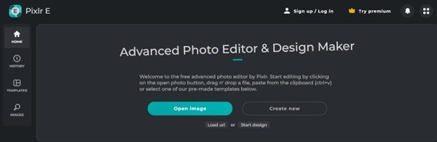
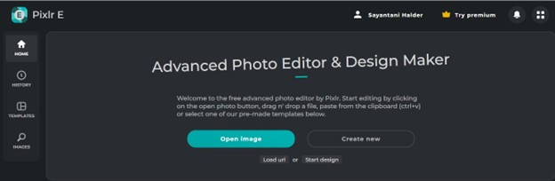
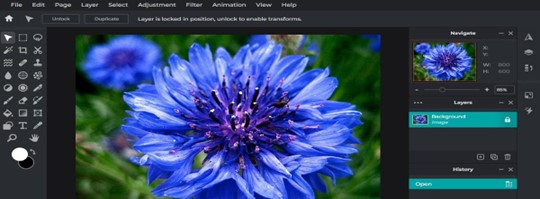
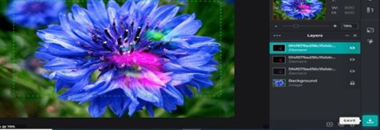
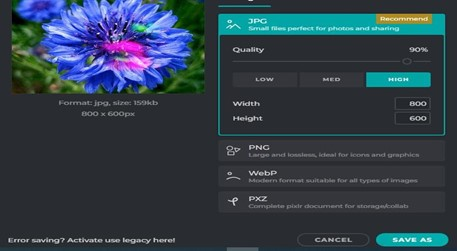

# How to Edit Photos Using Pixlr E

## Overview

Pixlr is a browser-based photo editing application that provides tools for creating and editing images without installing desktop software.

Pixlr offers editing options for different levels of experience:

- **Pixlr X** provides simplified editing tools suitable for beginners and common image-editing tasks.
- **Pixlr E** provides more advanced editing capabilities, including layers, selection tools, brushes, filters, and other image-editing features.

This guide explains how to use **Pixlr E** to upload an image, perform common editing tasks, and save the finished image.

## Prerequisites

Before you begin, ensure that:

- You have a stable internet connection.
- You are using a supported web browser.
- The image you want to edit is available on your device or through an accessible URL.
- You have permission to use and modify the selected image.

---

## Access Pixlr E

1. Open the **Pixlr E editor** in your web browser.
2. Sign up for a Pixlr account or log in using your existing credentials, if required.
3. After authentication, access the editor.

The editor provides several options for starting a project.

You can:

- Upload an image stored on your device.
- Open an image using its URL, where supported.
- Select an available image from Pixlr's image library.

Select the appropriate option and open the image you want to edit.

---

## Edit an Image

After opening an image, use the editing tools available in Pixlr E to modify it.

The following sections describe some common editing tasks.

### Crop an Image

Use the crop tool to remove unwanted areas from an image or change its dimensions.

1. Select the **Crop** tool from the toolbar.
2. Adjust the crop boundaries around the portion of the image you want to retain.
3. Review the selected area.
4. Apply the crop.

The areas outside the selected boundaries are removed from the image.

### Adjust Brightness and Color

You can adjust an image's brightness, contrast, and color settings using the available adjustment controls.

1. From the menu bar, select **Adjustment**.
2. Select **Brightness & Contrast**.
3. Adjust the available settings until you achieve the required result.
4. Apply the changes.

The **Adjustment** menu also provides additional options for modifying the appearance and color properties of an image.

### Add and Manage Layers

Layers allow you to work with different elements of an image independently.

To add a layer:

1. Select **Layer** from the menu bar.
2. Select the appropriate option for the type of layer you want to add.
3. Add or modify the required content.
4. Reposition or adjust the layer as necessary.

Using separate layers makes it easier to edit individual elements without modifying the rest of the image.

### Undo Changes

If you want to reverse a recent change:

1. Select **Edit** from the menu bar.
2. Select **Undo**.

Alternatively, press **Ctrl+Z** on Windows.

You can use the Undo option while editing to revert unwanted changes.

### Use Additional Editing Tools

Pixlr E also provides additional tools for more advanced editing tasks.

Depending on your requirements, you can use tools such as:

- **Lasso** to select specific areas of an image.
- **Brush** to draw or paint directly on an image.
- **Clone Stamp** to duplicate pixels from one area of an image to another.
- **Magic Wand** to select areas containing similar colors.
- **Text tools** to add captions or other text elements.
- **Filters and effects** to modify the overall appearance of an image.

After completing your edits, review the image before exporting it.

---

## Save and Export the Image

After editing the image, save or export the completed work.

Choose a file format based on how you intend to use the image.

| Format | Recommended Use |
| --- | --- |
| **PXZ** | Retaining an editable Pixlr project for future modifications |
| **JPG** | Photographs and images where smaller file sizes are preferred |
| **PNG** | Images that require high quality or transparency |
| **WebP** | Optimized images intended for websites |

If you plan to edit the project again, save a **PXZ** copy before exporting the final image.

---

## Summary

Using Pixlr E, you can perform common image-editing tasks directly from a web browser without installing desktop editing software.

In this guide, you learned how to:

- Open an image in Pixlr E.
- Crop an image.
- Adjust brightness, contrast, and color.
- Work with layers.
- Undo unwanted changes.
- Use additional editing tools.
- Save and export the completed image.

Select an export format based on where the image will be used, and retain a PXZ copy when you need to make further edits to the project.
